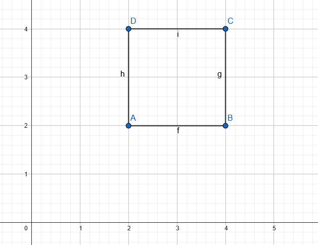
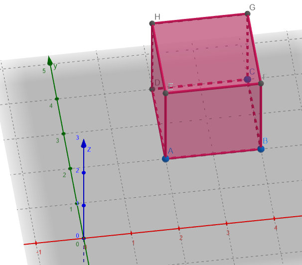

# Cubo em 3D

O seguinte projeto simula uma rotação de um cubo em 3 dimensões no terminal. Sendo que cada face possui um valor ASCII diferente das demais.

## Como é feito

O buffer onde tudo acontece, a `malha`, é inicializado e se multiplica  cada face por uma matriz de rotação. Se sobressai no frame final, as faces com o maior z em cada ponto $x$ e $y$ (aqui é usado `z-bufferização`).
Explicado melhor na subseção [Z-buffer](#z-buffer).

A `malha` e o `z_buffer` são reiniciados e os ângulos de rotação são incrementados a cada frame. Como só imprimimos a `malha` depois das rotações matriciais, há a impressão de que o cubo está se movendo.

>Simplificando para sermos mais didáticos: se rotacionarmos o cubo em 30° no eixo $x$ a cada momento (indicado por $t_i$), os frames do cubo serão:
>
> $$
> \begin{align*}
> t_0 = [1, 1, 1] \\
> t_1 = [30°, 1, 1]\\
> t_2 = [60°, 1, 1] \\
> \end{align*}
> $$

O que é feito no algorítmo é obter $t_0$ e rotacionar ele a partir de um ângulo que é incrementado a cada momento.

Note que a `malha` inicial é apenas um buffer preenchido com ' '. É explicado como é feito o desenho do cubo na subseção [Faces](#faces).
## Por dentro do código

###  Malha
A `malha` é o buffer que é onde é feito as transformações matriciais e as rotações, é a imagem do que está sendo visto. Vale notar que este vetor sempre é setado para o valor inicial a cada frame/impressão do conteúdo.

### Z-buffer
É utilizado um buffer adicional que data a profundidade de cada pixel na `malha`, o `z_buffer`. A z-bufferização é uma técnica simples de computação gráfica que anota o quão perto os objetos da imagem estão.

No projeto, os pixels dos objetos mais longes estão como $0$ e quanto maior a coordenada $z$ de um pixel (aqui são pontos das faces do cubo), mais proximo do observador este pixel está. 

Se dois objetos tem a mesma coordenada em $(x,y)$, aparecerá o pixel do objeto mais próximo (quem tiver a maior coordenada $z$ , aparece).

```c
void insere_ascii(char* buffer, int coord, char c) {
    if (coord >= 0 && coord < TELA_LARGURA * TELA_ALTURA) {
        // so se coloca o caractere caso ele esteja mais proximo que o valor atual do zbuffer nessa coordenada
        if (ultimo_z_calculado > zbuffer[coord]) {
            buffer[coord] = c;

            // valor do zbuffer atualizado, pois ainda pode receber atualizacoes
            zbuffer[coord] = ultimo_z_calculado;
        }
    }
}

```
O `ultimo_z_calculado` é uma variável global autoexplicativa (guarda o último z calculado caso não tenha entendido). Não há perigo de sobrescrita desse valor pois a função ``insere_ascii()`` é chamada logo após o cálculo das coordenadas.

### Faces 

Caso tenha se perguntado "mas como é feito o cálculo das faces?", depois de ver isso: 
```c

void transforma_malha(char* buffer, t_TrigValues* cos_senos) {
    int coord = 0;
    for (int i = -ALTURA; i < ALTURA; i++) {
        for (int j = -LARGURA; j < LARGURA; j++) {
            /* cada giro de ponto é para um dos caracteres, qual 
            deles realmente vai aparecer é decidido pelo 
            z-buffer.
            os tres parametros ditam qual face que esta sendo 
            calculada (pode ser altura no lugar de largura, 
            pois eh um cubo).
            */
            coord = gira_coord(j, i, -LARGURA, cos_senos);
            insere_ascii(buffer, coord, '#');

            coord = gira_coord(-LARGURA, i, j, cos_senos);
            insere_ascii(buffer, coord, '?');

            coord = gira_coord(LARGURA, i, j, cos_senos);
            insere_ascii(buffer, coord, '~');

            coord = gira_coord(-j, i, LARGURA, cos_senos);
            insere_ascii(buffer, coord, '@');

            coord = gira_coord(j, -LARGURA, i, cos_senos);
            insere_ascii(buffer, coord, '*');

            coord = gira_coord(j, LARGURA, i, cos_senos);
            insere_ascii(buffer, coord, '.');
        }
    }
}

```
"Como assim ditam qual face está sendo calculada?". 

Bem, se o lado esquerdo da face frontal é por exemplo em $x=2$, concordemos que a face esquerda é uma linha reta horizontal do ponto de perspectiva do observador, e em todos os pontos, o seu valor em $x$ é $2$ também.

Ilustrando:



A face $h$ está constante no eixo $x$, o que muda apenas é apenas suas coordenadas em $y$ e $z$.
O seguite trecho de código demostra o cálculo disso: `-LARGURA` é a posição em que começa a face esquerda

```c
            coord = gira_coord(-LARGURA, i, j, cos_senos);
            insere_ascii(buffer, coord, '?');
```


Uma visualização em 3 dimensões para complementar. A face esquerda é a [D,E,H,A].

### A função gira_coord()
É aqui que acontece a rotação dos pixels do cubo. Cada face tem seu pixel inicial calculado para a rotação nos angulos $\alpha, \beta, \gamma$, sendo cada um referente aos eixos $x, y, z$ respectivamente.

Ao final da função, é feito a adaptação com os offsets, fazendo o deslocamento dos pixels para o centro da tela.

A matriz de rotaçao usada foi essa:

```math
\begin{bmatrix}
x \\\ y \\\ z
\end{bmatrix}

=
\begin{bmatrix}
\cos(\beta) \cos(\gamma) x + \cos(\beta) \sin(\gamma) y - \sin(\beta) z \\
(-\cos(\alpha) \sin(\gamma) + \sin(\alpha) \sin(\beta) \cos(\gamma)) x + (\cos(\alpha) \cos(\gamma) + \sin(\alpha) \sin(\beta) \sin(\gamma)) y + \sin(\alpha) \cos(\beta) z \\
(\sin(\alpha) \sin(\gamma) + \cos(\alpha) \sin(\beta) \cos(\gamma)) x + (-(\sin(\alpha) \cos(\gamma)) + \cos(\alpha) \sin(\beta) \sin(\gamma)) y + \cos(\alpha) \cos(\beta)z
\end{bmatrix}
```

## Como compilar
Caso queira compilar o executavel, é necessário que tenha um compilador de c disponível. De preferência gcc.

```
gcc cubo.c -lm -o cubo
```

## Como executar
No diretório do projeto, digite no terminal:

### Para Windows

```
cubo.exe
```

### Para Linux

```
./cubo.exe
```

## Portabilidade
Ele foi desenvolvido em Windows e não testei em linux, mas acho que funciona também. Fique a vontade para testar!

## Conclusão e Comentários Finais

A ideia do projeto veio com os seguintes vídeos: [ASMR Programming - Spinning Cube - No Talking](https://youtu.be/p09i_hoFdd0?si=7UlHO0lwjdjI9mPo) e [Animation of a cube ASCII in C](https://youtu.be/jn5kZo1_KjU?si=Er577sVyxrlMHu9j), se achar o projeto parecido com algum deles, não é por acaso.

Descobri no final de 2023 esses tipos de vídeos de programação mudos e achei eles até que interessantes, tirando a parte que se você deseja implementar, acaba que é uma dor de cabeça entender o que está sendo feito (isso é um aviso para quem tente).

Apesar disso, adorei reaprender e aprender um pouco de geometria analítica. Também fiquei interessado pela área de computação gráfica!
